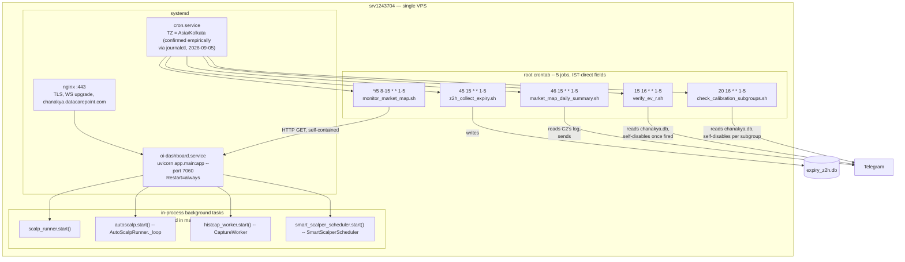

# Chanakya / zerohero — Actual Current Architecture (as of 2026-09-05)

**Inspection only.** No code, config, cron schedule, trading logic, or calibration was
changed while producing this document. `live_trading` confirmed `false` throughout
(`curl /api/health` → `{"status":"ok","live_trading":false,"paper_mode":true}`).

Every connection below is backed by a file path + function/class, verified this pass —
not inferred from a filename. 130 Python files, ~24,000 LOC in `app/`.

---

## A. One-page summary

This is a single FastAPI process (`oi-dashboard.service`, uvicorn, port 7060, behind
nginx TLS at `chanakya.datacarepoint.com`) that runs **two independent autonomous PAPER
scalping engines** side by side (`AutoScalpRunner` and `SmartScalperPaperEngine`/
`SmartScalperScheduler`), plus **four read-only analysis subsystems**
(`mathematical_confluence`, `greeks_engine`, `histcap`, `expiry_zero_to_hero`) that feed
the dashboard and each other. All of it shares one AngelOne WebSocket feed connection and
one SQLite database (`data/chanakya.db`), with two satellite SQLite files
(`market_history.db` for captured broker data, `expiry_z2h.db` for SENSEX expiry
research). A real LIVE order-execution module exists (`app/execution/`) and is
triple-gated off — the autonomous engines never import it. Five weekday cron jobs do
monitoring/verification/research-capture; a timezone bug in all five (fixed today,
commit `ba39a9c`) is the most recent change to this system.

---

## B. Actual Mermaid architecture diagram

```mermaid
flowchart TD
    subgraph USER["USER / UI LAYER"]
        BROWSER["Browser dashboard\nfrontend/index.html + static/js/app.js"]
    end

    subgraph API["API LAYER — app/main.py + app/api/*"]
        AUTH["_auth_gate middleware\n(Basic-Auth admin/admin@1234 default\nor Bearer CHANAKYA_API_TOKEN)"]
        ROUTERS["10 APIRouters\nengines/instruments/analysis/scalp/\nexecution/monitor/autoscalp/positions/data/system"]
        SUBROUTERS["4 subsystem routers (already modular)\nhistcap.api / greeks_engine.api /\nmathematical_confluence.api / smart_index_scalper.api"]
        WS_EP["/ws endpoint\napp/main.py:ws_endpoint"]
    end

    subgraph CORE["RUNTIME COMPOSITION ROOT — app/runtime.py"]
        MANAGER["ConnectionManager\n(WebSocket broadcast to browser tabs)"]
        SCALPRUN["ScalpRunner\napp/scalper.py (manual/legacy engine)"]
        AUTOSCALP["AutoScalpRunner\napp/autoscalp/runner.py"]
    end

    subgraph ENGINES["TRADING / ANALYSIS ENGINES — app/engines/*"]
        SR["sr_engine.compute_sr\nsupport/resistance zones + GEX"]
        STATE["state_classifier.classify\n4-state + false-breakout, 9-component score"]
        REGIME["regime_mtf\ndetect_regime + mtf_alignment"]
        OPT["option_engine\nanalyse_leg / select_option / ev_gate"]
        OIMATH["oi_math.max_pain_strike\n(shared, extracted 2026-09-05)"]
        OIENG["oi_options_engine\nrule-based strike selection"]
        SIGENG["signal_engine\n_atr/_vwap/_rsi/_ema/_adx primitives"]
        STRAT["scalp_strategy.decide_from_context\ncomposes SR+state+regime+option->signal"]
        RISK["risk_engine"]
        PAPER["paper_trading\nopen_trade/close_trade/update_trade_price"]
        TP["turning_point_engine"]
    end

    subgraph AUTOSC["AutoScalp (main autonomous engine)"]
        AS_LOOP["_loop -> tick_once -> _evaluate\n(per symbol every 30s, asyncio.to_thread\nfor chain-fetch/decide/persist since 2026-09-01)"]
        AS_CHAIN["_autoscalp_chain\napp/runtime.py -> market_data.selection_snapshot\n(OWN direct SDK call, not market_hub)"]
        AS_CALIB["_maybe_recalibrate\napp/backtest/calibration.fit()\nglobal logistic curve every 900s, n>=40"]
    end

    subgraph SMARTSC["Smart Scalper (2nd autonomous engine)"]
        SS_SCHED["SmartScalperScheduler\napp/smart_index_scalper/scheduler.py\nDISARMED by default"]
        SS_PAPER["SmartScalperPaperEngine\napp/smart_index_scalper/paper_engine.py"]
        SS_SCAN["scanner.py + eligibility.py\nranks the index universe"]
    end

    subgraph MATHCONF["mathematical_confluence (read-only)"]
        MC_CTX["context.py market_context()\n-> market_hub.snapshot()"]
        MC_LEVELS["levels.py\nreuses turning_point_engine._pivots\n+ own Gann-balance levels"]
        MC_CONF["confluence.py + oi_confluence.py\n(imports expiry_zero_to_hero.oi_change)"]
    end

    subgraph MARKETHUB["app/market_hub.py — single read path (Phase 2-4)"]
        MH["snapshot(sym)\nWS feed -> histcap DB -> throttled REST\nallow_rest_fallback=False for bulk reads"]
    end

    subgraph BROKER["BROKER LAYER — app/connectors/*"]
        FEEDREG["feed_registry.py\nset_feed()/get_feed() — ONE shared feed"]
        ANGELWS["angel_ws.AngelMarketFeed\nWebSocket LTP feed"]
        ANGELREST["angelone.py\n_market_sdk / _login / fetch_candles /\nfetch_market_quote — REST + TOTP"]
        ORDERS["angelone_orders.py\nplace_order/modify/cancel (REST)"]
    end

    subgraph EXEC["execution/ — LIVE order path (UNUSED by any autonomous engine)"]
        OM["OrderManager + TradeMonitor + Reconciler"]
        ABROKER["AngelOneBroker\ntriple gate: execution_mode==LIVE\nAND env CHANAKYA_ALLOW_LIVE==1\nAND env CHANAKYA_LIVE_CONFIRM_TOKEN"]
        KILL["killswitch.py\nglobal emergency stop"]
    end

    subgraph STORAGE["STORAGE"]
        DB1[("data/chanakya.db\nai_paper_trades, scalp_signals,\nlive_market_snapshots, broker_orders,\ntrade_entry_features, app_settings, ...")]
        DB2[("data/market_history.db\n(histcap) raw_responses, market_candles,\nquote_snapshots, option_greeks\n+ greeks_engine's own tables")]
        DB3[("data/expiry_z2h.db\nexpiry_z2h_windows/analysis")]
    end

    subgraph RUNTIME["RUNTIME / CRON"]
        HISTCAP_W["histcap.worker.CaptureWorker\nleader-elected, in-process asyncio task"]
        CRON1["z2h_collect_expiry.sh — 15:45 IST"]
        CRON2["monitor_market_map.sh — */5 08:00-15:55 IST"]
        CRON3["market_map_daily_summary.sh — 15:46 IST"]
        CRON4["verify_ev_r.sh — 16:15 IST"]
        CRON5["check_calibration_subgroups.sh — 16:20 IST"]
    end

    BROWSER -->|HTTP/WS, Basic-Auth| AUTH --> ROUTERS
    ROUTERS --> SUBROUTERS
    BROWSER <-->|WS, 401 without auth| WS_EP --> MANAGER

    ROUTERS --> CORE
    CORE --> AUTOSC
    CORE --> SCALPRUN

    AUTOSC --> AS_LOOP --> AS_CHAIN --> ANGELREST
    AS_LOOP --> STRAT
    STRAT --> SR & STATE & REGIME & OPT & OIENG
    OPT --> OIMATH
    STRAT --> PAPER --> DB1
    AS_LOOP --> AS_CALIB --> DB1
    AS_LOOP --> KILL

    SMARTSC --> SS_SCAN --> MC_CTX
    SS_PAPER --> PAPER
    SS_SCHED -.->|DISARMED, manage() only| SS_PAPER

    MATHCONF --> MC_CTX --> MH
    MC_CTX --> MC_LEVELS --> TP
    MC_CONF --> MC_LEVELS

    MH --> DB2
    MH -->|WS spot| FEEDREG
    MH -->|throttled REST fallback,\nallow_rest_fallback=True only\nfor single-symbol reads| ANGELREST

    SCALPRUN --> FEEDREG
    FEEDREG --> ANGELWS --> ANGELREST

    EXEC -. never imported by\nAUTOSC or SMARTSC .-> AUTOSC
    OM --> ABROKER --> ORDERS
    EXEC --> DB1

    HISTCAP_W --> ANGELREST
    HISTCAP_W --> DB2
    HISTCAP_W -.->|triggers on capture| GREEKSENG["greeks_engine.engine\n(reads DB2, writes DB2)"]

    CRON1 --> DB3
    CRON2 --> ROUTERS
    CRON3 --> ROUTERS
    CRON4 --> DB1
    CRON5 --> DB1
```

**What is NOT connected (verified by absence, not just omission):** `EXEC` (the LIVE
order module) has zero import edges from `AUTOSC`, `SMARTSC`, or `SCALPRUN` — grep-
verified (`app/autoscalp/` imports no `execution` module beyond `killswitch`, a safety
control, not an order path).

---

## C. Market-data → signal data-flow diagram

This traces one AutoScalp tick (`app/autoscalp/runner.py: AutoScalpRunner._evaluate`,
called every `decide_every_sec` (30s default) per symbol) — the actual live, currently-
armed path, not the disarmed Smart Scalper or the legacy manual `ScalpRunner`.

```mermaid
flowchart LR
    A["AngelOne WebSocket\nAngelMarketFeed.on_tick"] -->|live LTP| B["CandleAggregator\napp/autoscalp/aggregator.py\nbuilds 1m/5m bars per symbol"]
    B --> C["_autoscalp_chain()\napp/runtime.py\n-> market_data.selection_snapshot()\n(broker REST, ATM+/-window option chain)"]
    C -->|"asyncio.to_thread since 2026-09-01\n(feed-staleness fix)"| D["decide_from_context()\napp/engines/scalp_strategy.py"]
    D --> E1["compute_sr()\nS/R zones, ATR, VWAP, GEX"]
    D --> E2["detect_regime() + mtf_alignment()\nregime label + -100..+100 magnitude"]
    D --> E3["classify()\n9-weighted-component state_score\n(price_action .20, level_strength .16,\nvolume .12, oi .12*, momentum .14,\nvwap .08, atr .08, htf .06, retest .04)\n*oi found dead (always 0) 2026-09-05 audit"]
    D --> E4["analyse_leg()/select_option()\noption final_quality 0-100"]
    E1 & E2 & E3 & E4 --> F["blended = .62*state_score\n+ .24*final_quality\n+ .14*min(100,mtf_mag+40)\nx regime/signal_type/tod multipliers"]
    F --> G["_score_to_prob()\nprior sigmoid OR fitted global curve\n(app/backtest/calibration.py,\ncurves:{} empty -- global only)"]
    G --> H["ev_gate()\napp/engines/option_engine.py\nEV_R + RR threshold"]
    H -->|pass| I["Safeguards.check_entry()\napp/autoscalp/safeguards.py\ndaily loss/trade caps, kill switch,\nfeed-age <=12s, duplicate-position"]
    I -->|pass| J["paper_trading.open_trade()\napp/engines/paper_trading.py\nPAPER ONLY -- no broker call"]
    J --> K["db.insert_scalp_signal +\ndb.insert_trade\ndata/chanakya.db"]
    K --> L1["/api/autoscalp/status,\n/report, /selfcheck"]
    K --> L2["ConnectionManager.broadcast\n-> browser /ws"]
    K --> L3["Telegram (HIGH confidence only,\napp/autoscalp/notify.py)"]
    J --> M["TradeMonitor loop (per-tick)\nmark price -> SL/T1/T2/trail/time-exit"]
    M --> N["close_trade() -> outcome WIN/LOSS/FLAT\n-> _maybe_recalibrate() feeds this\nback into the SAME global curve\n(no train/eval split -- 2026-09-05 finding)"]
    N --> K
```



**Where this stops if a gate fails:** `_advisory()` path (still records `signal_score`/
`probability`/`component_scores` for dashboard display, `decision: NO_TRADE`), or
`out_none()` (bare NO_TRADE, no score attached) — both persist to `scalp_signals` for
observability even on a refusal. Neither ever reaches `paper_trading.open_trade`.

---

## D. Runtime / cron architecture diagram



**Chronological ordering (confirmed correct, but NOT a data pipeline):** C1 (15:45) <
C3 (15:46) < C4 (16:15) < C5 (16:20). C1's SENSEX-expiry dataset (`expiry_z2h.db`) is
functionally unrelated to C4/C5's autoscalp `scalp_signals` checks — three independent
monitors scheduled in the same afternoon window, not a producer→consumer chain.

**SCRIPT → TRIGGER → DATA SOURCE → OUTPUT:**

| script | trigger | reads | writes/sends |
|---|---|---|---|
| `z2h_collect_expiry.sh` | cron 15:45 IST, weekdays | `angelone.fetch_candles` (14:50-15:40 IST window) | `expiry_z2h.db` |
| `monitor_market_map.sh` | cron every 5min, 08:00-15:55 IST | `GET /api/mathematics/market-map`, `/signal` | `data/market_map_monitor.log`; embedded watchdog (see below) sends Telegram on a missed daily summary |
| `market_map_daily_summary.sh` | cron 15:46 IST | `data/market_map_monitor.log` | Telegram + `data/market_map_summary_sent.log` |
| `verify_ev_r.sh` | cron 16:15 IST | `scalp_signals` table (`data/chanakya.db`) | Telegram + `data/verify_ev_r_result.log`; self-disables (removes own crontab line) once it finds any `ev_r`-populated row |
| `check_calibration_subgroups.sh` | cron 16:20 IST | `scalp_signals` table | Telegram + `data/calibration_subgroups_state.json`; alerts once per subgroup, self-disables once all 3 have alerted |

**Watchdog embedded inside `monitor_market_map.sh`** (not a separate cron): checks
`date -u` hour/minute == 10:25+ UTC (= 15:55+ IST) to verify the day's summary sent;
correct/UTC-aware internally, but only reachable at the schedule's last tick (15:55 IST)
since the cron's own hour range stops there — a narrow but intact window, noted in the
prior verification pass, not fixed (out of scope, not evidence the main fix is wrong).

---

## E. Module dependency map

Verified via `grep` of every `from ..<package>` cross-package import (not intra-package):

```
api             -> autoscalp, connectors, engines, execution
autoscalp       -> backtest, connectors, engines, execution
backtest        -> engines
connectors      -> (none — leaf package)
engines         -> connectors
execution       -> connectors
expiry_zero_to_hero -> connectors, engines, histcap
greeks_engine   -> histcap
histcap         -> connectors, greeks_engine   [see note]
mathematical_confluence -> connectors, engines, expiry_zero_to_hero, feed_registry, histcap
smart_index_scalper -> autoscalp, engines, histcap, mathematical_confluence
```

**`histcap <-> greeks_engine` — logical circularity, not a hard Python cycle.** Verified
both sides are guarded: `histcap/worker.py:208` imports `greeks_engine.engine` **lazily,
inside a function** (not at module top); `greeks_engine/engine.py:21` imports
`histcap.store.DB_PATH` at module level but wrapped in `try/except` with a hardcoded
fallback path. Deliberate pattern (capture worker triggers a post-processing engine that
reads the same DB it just wrote to), defensively written so import order can never break
either module. Not flagged as a bug.

**No other circular dependency found** among the 11 top-level packages.

**Duplicate data-fetching found (see §13):** `autoscalp` fetches its option chain via its
own `_autoscalp_chain()` -> `market_data.selection_snapshot()` (direct broker REST),
while `mathematical_confluence` / `smart_index_scalper` go through the newer
`market_hub.snapshot()` (WS feed -> histcap -> throttled REST). Two independent chain-
fetch code paths for the same broker, not unified — `market_hub` (built 2026-09-01,
Phase 2-4 of an earlier architecture audit) only replaced the newer engines' REST
polling, not `autoscalp`'s older, already-working path.

**Dead/orphan code:** none found among top-level `app/*.py` files — every one is
imported at least once, except `mcp_server.py` (0 imports), which is a deliberate
standalone entry point (`python -m app.mcp_server`, has its own `if __name__ ==
"__main__"`, documented as an MCP tool server for Claude integration) — not dead code.

**Duplicated calculation, one confirmed instance (fixed 2026-09-05):** `max_pain`'s
textbook formula was independently re-derived, byte-for-byte identical, in
`oi_options_engine.py`, `autoscalp/runner.py._chain_oi_quality`, and
`turning_point_engine.py._oi_metrics` — extracted to `engines/oi_math.max_pain_strike()`
(commit `9698063`). ATR/VWAP/S-R/Gann were checked in the same pass and found to be
**already** singly-implemented (false positives from an earlier grep-based audit) — see
`CALIBRATION_OVERCONFIDENCE_AUDIT.md`'s companion finding and the git history around that
commit for the full false-positive breakdown.

---

## F. Paper/live safety path

**Where the app hard-declares PAPER:**
- `app/api/system_routes.py: api_health()` → `{"live_trading": False, "paper_mode": True}` — hardcoded literal, not a config toggle.
- `app/autoscalp/runner.py: AutoScalpRunner.status()` → `"live_trading": False, "paper_mode": True` — same, hardcoded.
- `app/smart_index_scalper/scheduler.py: SmartScalperScheduler.status()` → `"live_trading": False` — same.
- `app/engines/paper_trading.py` module docstring: *"No real orders are ever placed. live_trading is always false."* — grep-verified: this file contains no `requests`/`http`/broker import at all.

**The one real LIVE path that exists, and its triple gate** (`app/execution/angelone_broker.py: AngelOneBroker._guard_live`, called from every submit/modify/cancel method before any network call):
```
live_enabled = (self.mode == "LIVE")
           AND (os.environ.get("CHANAKYA_ALLOW_LIVE") == "1")
           AND bool(self._confirm)   # os.environ.get("CHANAKYA_LIVE_CONFIRM_TOKEN")
```
`self._confirm` is read **only** from process environment in `__init__` — never from the
DB-persisted runtime config dict, even if a caller tries to smuggle it in there
(verified by a dedicated regression test, `tests/test_execution_live_gate.py::
test_confirm_token_never_read_from_runtime_config_only_env`, added 2026-09-04).

**Can any code path bypass this?** No import edge exists from `AutoScalpRunner` or
`SmartScalperScheduler`/`SmartScalperPaperEngine` to `app.execution.*` — grep-verified
(`app/autoscalp/` imports only `execution.killswitch`, a read/stop control, never
`OrderManager`/`AngelOneBroker`). `app/execution/` is a fully separate module tree that
nothing in the two autonomous engines ever calls. Both `CHANAKYA_ALLOW_LIVE` and
`CHANAKYA_LIVE_CONFIRM_TOKEN` are confirmed absent from the live service's `.env` right
now (checked this pass: `grep -c` for both = 0).

---

## G. Performance bottlenecks (identified, not yet acted on)

1. **`autoscalp`'s per-cycle chain fetch is a direct synchronous broker REST call**
   (`market_data.selection_snapshot`, ~10 option quotes), run inside `asyncio.to_thread`
   since the 2026-09-01 feed-staleness fix — correctly off the event loop now, but still
   a real ~1-5s broker round-trip per symbol per 30s tick, ×5 symbols.
2. **Two independent option-chain fetch paths** (autoscalp's own vs. `market_hub`'s) mean
   the broker sees more total REST volume than a single shared path would produce — not
   unified (see §E).
3. **Most FastAPI routes are plain `def`, not `async def`** (54 sync vs. ~11 async
   across `app/api/*`) — Starlette runs these in a threadpool automatically, so this
   doesn't block the event loop, but it does mean each such request occupies a threadpool
   worker for its full duration (default pool size, not tuned for this app specifically).
4. **`_maybe_recalibrate` reads up to 2000 rows from `scalp_signals` every 900s** once
   armed and ≥40 resolved samples exist (`db.list_scalp_signals(..., limit=2000)`) — cheap
   at current data volume (n=74), will grow linearly with trade history with no windowing.
5. **Single-process leader lease** (`LEASE_TTL=30s` for autoscalp, similar for Smart
   Scalper) — acceptable for PAPER; a crashed leader means up to 30s of no evaluation
   before another worker (if any) picks it up. Only one uvicorn worker is configured
   (`--workers 1` in the systemd unit), so this is currently theoretical, not exercised.
6. **`monitor_market_map.sh` samples every 5 minutes via a fresh `curl` process** —
   trivially cheap, but it's a shell-level poller rather than reusing any in-process
   connection; not a real bottleneck at this frequency.

No unbounded polling loop, no busy-wait, and no N+1-style query pattern was found in the
paths inspected this pass.

---

## H. Architecture risks (health table)

| Component | Current implementation | Status | Risk | Recommendation |
|---|---|---|---|---|
| Admin auth | Single hardcoded Basic-Auth admin/admin@1234 default, `.env` override never set | 🟡 YELLOW | Publicly reachable app on its documented default credential | User has deferred this to a planned login-UI project (admin/registration/guest) — tracked, not urgent-blocking |
| CORS | Pinned to production origin (fixed 2026-09-05) | 🟢 GREEN | none currently known | — |
| Execution layer test coverage | 53 tests added 2026-09-04, covering the triple live-gate exhaustively | 🟢 GREEN | none currently known | keep growing coverage as `order_manager`/`reconciler` logic evolves |
| Two independent option-chain fetch paths (autoscalp vs market_hub) | Both call the same broker independently | 🟡 YELLOW | More broker REST volume than necessary; two places to keep in sync if the chain shape ever changes | Migrate `autoscalp`'s `_autoscalp_chain` onto `market_hub` when there's bandwidth — not urgent, both currently work |
| Calibration methodology | Live recalibration fits and evaluates on the same undifferentiated resolved-signal pool (no train/eval split), contradicting its own module docstring | 🟡 YELLOW | Reported calibration quality is optimistic vs. true out-of-sample performance | Documented as K8 in `PRODUCTION_READINESS.md`; being watched via cron for n>=20 subgroups before any change |
| `oi` scoring component | Always exactly 0.0 across 100% of 74 observed trades | 🟡 YELLOW | 12% of `state_score`'s intended weight is dead | Root cause not fully traced (needs a live chain dump); flagged, not fixed, per this session's read-only mandate |
| Cron scheduling | Fixed today (commit `ba39a9c`) after discovering all 5 jobs fired 5.5h early (UTC/IST mixup) | 🟢 GREEN (schedule verified) / ⏳ pending (Monday execution not yet observed) | Low now; was a real production monitoring gap before the fix | Monday 07-Sep verification already scheduled (session reminder + durable cron) |
| LIVE order path | Fully separate module tree, never imported by either autonomous engine, triple-gated, confirm-token env-only | 🟢 GREEN | none found | keep the existing regression test as a permanent guard against regression |
| Two autonomous engines running independently (AutoScalp armed, Smart Scalper disarmed) | Share one WS feed correctly; do not share a calibration/config layer | 🟢 GREEN (no conflict found) | Low — they don't compete for the same trades today (Smart Scalper is disarmed) | if both are ever armed together, verify they don't double-count safeguards budgets (not currently applicable) |
| Single DB, WAL mode, single writer process | `sqlite3` with `PRAGMA journal_mode=WAL`, `busy_timeout=3000` | 🟢 GREEN | fine at current scale | revisit only if trade/signal volume grows by orders of magnitude |

---

## I. Recommended production architecture (separate from the above — this section only)

*(Improvement proposals. Nothing here has been implemented; this is explicitly the "then
separately explain" half of the request.)*

1. Unify the two option-chain fetch paths onto `market_hub` so there is exactly one
   broker-facing chain reader instead of two.
2. Add a real train/eval split to `_maybe_recalibrate` (e.g. fit on all-but-last-N
   resolved trades, evaluate the report on a held-out tail) so `calibration-report`
   reflects genuine out-of-sample performance.
3. Root-cause the dead `oi` component with a live chain dump during market hours, then
   either fix the wiring or drop its weight and redistribute it to components that do
   carry signal.
4. Once per-(regime,signal_type) sample sizes clear the 20-sample floor (already being
   watched via `check_calibration_subgroups.sh`), let per-key calibration curves populate
   instead of relying solely on the global curve.
5. Move the standalone `.sh` monitoring scripts' scheduling logic into a single supervised
   scheduler (e.g. APScheduler inside the app process, or a dedicated small cron-runner
   service) so timezone assumptions live in one verified place instead of being
   hand-written per script.
6. Replace the shared admin/admin@1234 Basic-Auth with the planned login UI
   (admin/registration/guest roles) — already tracked as a deferred user decision.

## J. Exact differences: CURRENT vs. RECOMMENDED

| Aspect | CURRENT (verified) | RECOMMENDED |
|---|---|---|
| Option chain fetch | 2 independent paths (autoscalp direct REST, market_hub for newer engines) | 1 unified path via market_hub |
| Calibration fit/eval | Same pool for both (no split) | Chronological train/eval split |
| `oi` scoring component | Dead (0.0 always) | Root-caused and either fixed or removed |
| Calibration granularity | Global-only (`curves: {}` empty) | Per-(regime,signal_type) curves once n>=20 per key |
| Cron scheduling | 5 independent hand-written `.sh` files + crontab, TZ-fragile by hand | Single supervised scheduler, TZ-safety centralized |
| Admin auth | Shared static Basic-Auth credential | Login UI: admin / registration / guest roles |

---

*Every claim above traces to a file path, function/class name, and a command run this
pass (grep output, live `/api/*` reads, `journalctl`, or a prior-verified test file) —
none is inferred from a filename or a comment alone.*
